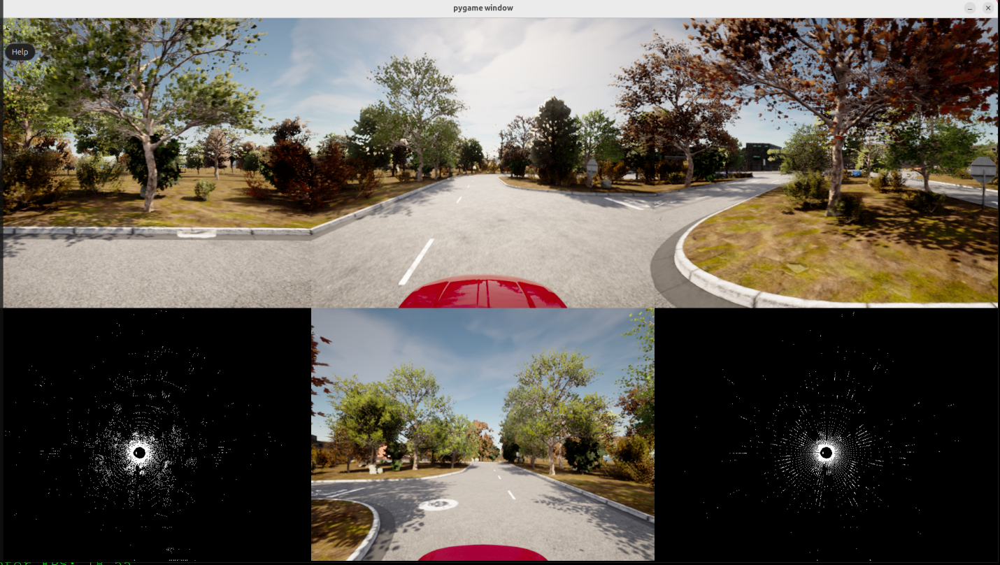

# carla-vehicle-zmq

## Introduction

This is a carla vehicle instance running on the X86 platform. It establishes a CARLA Vehicle Client, using ZMQ as the subscriber and publisher to send and receive vehicle sensors data to the application running on the different platforms based on different programming SDK(such as ROS2 on aarch64).

It enables the application running on the different platforms to get the vehicle sensors data from CARLA and control the vehicle in CARLA without depending on the CARLA PythonAPI only built for the x86 platform.

## Usage

### launch the carla vehicle

a. launch the carla engine
```bash
bash CarlaUE4.sh -RenderOffScreen
```

b. launch the carla vehicle
```bash
python3 main.py --rig=./rigs/carla-vehicle-default.json
```

### launch the visualization application(optional)

```bash
python3 visualization.py --rig=./rigs/carla-vehicle-default.json --res=1920x1080
```

### reference running snapshot




